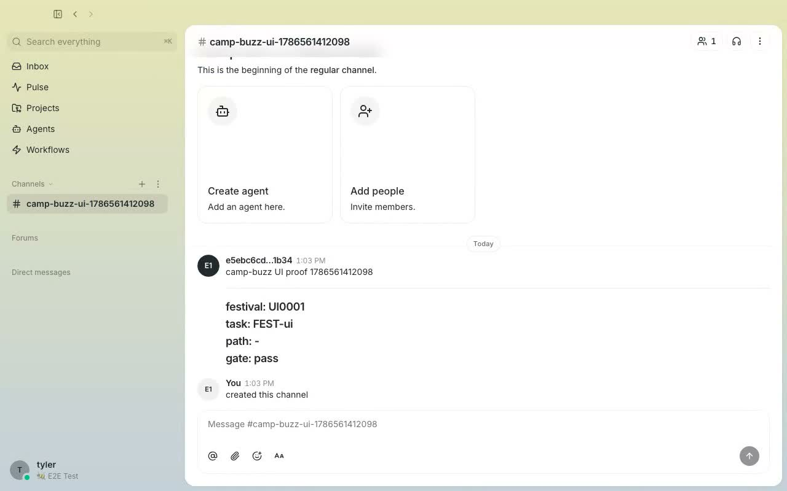
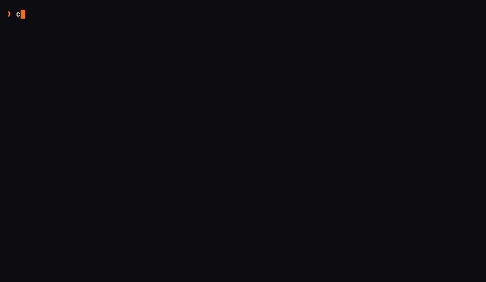
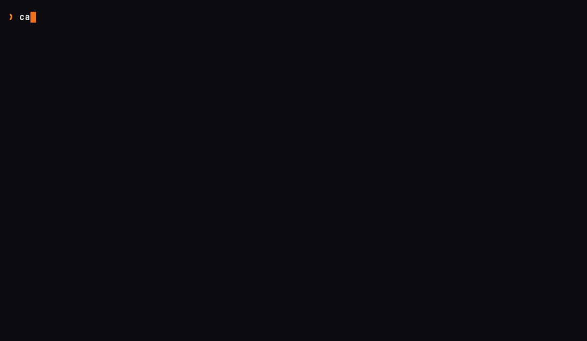
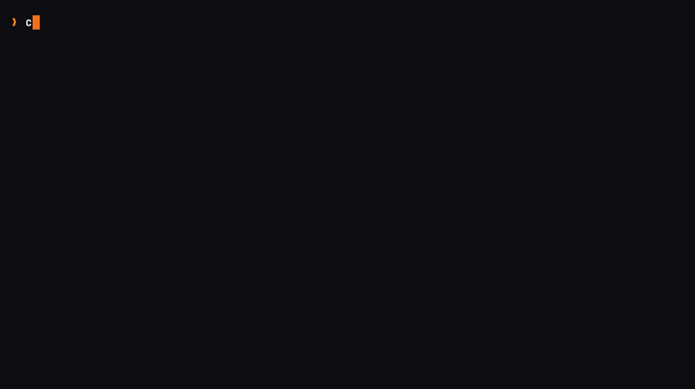

# camp-buzz

[](https://github.com/Obedience-Corp/camp-buzz/actions/workflows/test.yaml)

Optional **Buzz status-projection** plugin for
[camp](https://github.com/Obedience-Corp/camp).

> [!IMPORTANT]
> This is an independent Obedience Corp project. It is not affiliated with,
> endorsed by, or supported by Block, Inc. Buzz names and trademarks belong to
> their respective owners.

This is **not** native Buzz support in camp or fest. It is a standalone
`camp-*` plugin binary. When installed on your `PATH`, camp discovers it as:

```bash
camp buzz …
```

The supported product claim is status projection through an operator-provided
Buzz CLI and relay. This project does not provide or claim a hosted Block relay,
and installing it is never required to use camp, fest, or Festival.

**Design:** campaign workitem WI-ca719b  
`workflow/design/festival-buzz-integration` (Obey campaign).

## What it does

| Command | Purpose |
|---------|---------|
| `camp buzz doctor` | Check buzz CLI, env, bind config (never prints secrets) |
| `camp buzz post` | Post Festival status to a Buzz channel (footer-normalized) |
| `camp buzz bind` | Write `.campaign/integrations/buzz.yaml` (non-secret) |
| `camp buzz show` | Show resolved config (secrets redacted) |
| `camp buzz hook-install` | Print example fest hook YAML |

Posts shell out to the external **`buzz` CLI**. Festival remains source of
truth; Buzz is a projection surface.

## Demo

Three proof levels:

1. **Buzz Desktop UI** — Playwright records a real browser video of a
   `camp-buzz post` appearing in the channel timeline (live local relay).
2. **Real CLI** — full-color VHS of `camp-buzz` posting through the real
   `buzz` binary and reading the message back from the relay.
3. **Fixture GIFs** — offline demos with a fake `buzz` CLI (no relay).

### Buzz Desktop UI (Playwright video)

`camp-buzz post` → message + Festival footer visible in the channel UI.



<video src="docs/demos/camp-buzz-desktop-ui.mp4" controls width="100%" poster="docs/demos/camp-buzz-desktop-ui.jpg">
  <a href="docs/demos/camp-buzz-desktop-ui.mp4">Download Desktop UI demo (mp4)</a>
  ·
  <a href="docs/demos/camp-buzz-desktop-ui.webm">webm</a>
</video>

Re-record (needs Buzz monorepo desktop dist + live relay):

```bash
export BUZZ_BIN=/path/to/buzz/target/release/buzz
export BUZZ_DESKTOP_ROOT=/path/to/buzz/desktop
just demo-ui
```

### Real CLI (VHS, full color)

`doctor` → `post` (real `buzz`) → `buzz messages get` readback.

<video src="docs/demos/camp-buzz-cli-real.mp4" controls width="100%">
  <a href="docs/demos/camp-buzz-cli-real.mp4">Download CLI demo (mp4)</a>
</video>



```bash
export BUZZ_BIN=/path/to/buzz/target/release/buzz
export BUZZ_PRIVATE_KEY=…   # never commit
just vhs-cli-real           # needs vhs, ttyd, ffmpeg, live relay
```

### Fixture GIFs (offline / fake buzz)

Re-record with `just vhs` (needs `vhs`, `ttyd`, `ffmpeg`).

#### Plugin tour

`doctor` → `bind` → `show` → ready `doctor` → `post` → `hook-install` →
`camp buzz version`



#### Status post + footer

`post` then the mock buzz log showing the Festival footer contract:



## Install

### Festival installer (preferred)

The stable plugin is public in the official Obedience Corp marketplace. Use
Festival `v0.3.2` or newer so the installer deploys both the executable and its
managed runtime assets:

```bash
festival install camp-buzz
camp buzz version
camp buzz doctor
```

The executable is installed in Festival's managed `bin` directory. Templates
are installed under `~/.obey/plugins/camp-buzz/`.

### From source

```bash
just install
# or
go install github.com/Obedience-Corp/camp-buzz/cmd/camp-buzz@latest
```

### Assets

```bash
just install-assets   # → ~/.obey/plugins/camp-buzz/
```

### Release cut (maintainers)

```bash
just release gate       # complete containerized release-readiness gate
just release check      # validate goreleaser config
just release snapshot   # local snapshot build
just release package-check <next-version> # validate assets without publishing
just release stable     # tag next patch and push (triggers GH release)
# or: just release tag <new-version>
```

Release tags are immutable. If a published tag already exists, fix forward
under a new semantic version; never move or replace the existing tag.

Both tag commands run `just release gate` after confirming a clean,
synchronized `main` and before creating the tag. The tag workflow then proves
the tag still points to current `origin/main`, performs a non-publishing build,
and validates all four archive names, packaged files, binary architectures,
and SHA-256 checksums before the publishing job can start.

Marketplace registration lives in
[`Obedience-Corp/marketplace`](https://github.com/Obedience-Corp/marketplace)
(`obedience-corp/camp-buzz` + `release_source` pointing at this repo's GitHub
Releases). Asset names must match:

`camp-buzz-{version}-{os}-{arch}.tar.gz` with `os` ∈ {macOS,linux}, `arch` ∈ {x86_64,arm64}.

## Configure

```bash
export BUZZ_PRIVATE_KEY=…                 # secret — never commit
export BUZZ_RELAY_URL=http://localhost:3000  # HTTP base URL (not ws://)
camp buzz bind --channel <uuid> --relay http://localhost:3000 --festival CI0009
camp buzz doctor
```

`ws://` / `wss://` values are normalized to `http://` / `https://` for the
real `buzz` CLI, which documents an **HTTP** relay base URL.

## Testing against real Buzz

Fake-CLI demos (`just smoke`, `just vhs`) prove the plugin surface without a
relay. For the real stack:

```bash
# in the Buzz monorepo: just setup && just relay
export BUZZ_BIN=/path/to/buzz          # e.g. buzz/target/release/buzz
export BUZZ_PRIVATE_KEY=…              # from: buzz-admin generate-key
export BUZZ_RELAY_URL=http://localhost:3000
just smoke-real
```

This creates a disposable channel, posts via `camp-buzz post`, and reads the
message back with `buzz messages get`.

## Fest hooks (optional)

```bash
camp buzz hook-install
# merge into campaign/festival fest hooks config; map events with fest hooks list
```

Hooks must **fail open** — do not block fest advance on post failures.

## Development

```bash
just build
just test unit     # pure, host-safe unit suite
just test all      # unit + containerized filesystem integration suite
just release gate # full read-only-source release gate used by CI/tagging
just smoke         # full CLI smoke with fixture
just run doctor
just vhs           # regenerate docs/demos/*.gif
```

Smoke and VHS use `scripts/vhs-fixture.sh` + `scripts/fake-buzz` so `post`
is tested without a real Buzz deployment.

`just release gate` mounts the checkout read-only and runs Actionlint,
formatting, vet, unit/race tests, the fake-Buzz integration flow, Staticcheck,
govulncheck, working-tree and full-history Gitleaks scans, a binary build, and
GoReleaser configuration validation in containers. It fails if the checkout
changes.

## License

Apache License 2.0. See [LICENSE](./LICENSE).

Security reports and support expectations are documented in
[SECURITY.md](./SECURITY.md) and [SUPPORT.md](./SUPPORT.md). Contributions are
welcome under [CONTRIBUTING.md](./CONTRIBUTING.md).
